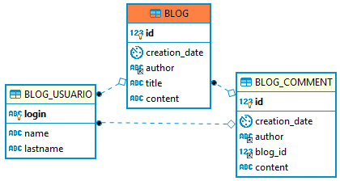
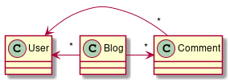

## Escuela Colombiana de Ingeniería

### PDSW – Procesos de desarrollo de Software
### Parcial Segundo Tercio


**IMPORTANTE**

* Trabajar en Linux (para evitar problemas con las instrucciones finales).
* Se puede consultar en la Web: APIs/Documentación de lenguaje y frameworks (Primefaces, Guice, MyBatis, etc), y enunciados de los laboratorios (se pueden revisar los fuentes incluidos con los dichos enunciados).
* No se permite: Usar memorias USB, acceder a redes sociales, clientes de correo, o sistemas de almacenamiento en la nube (Google Drive, DropBox, etc). El uso de éstos implicará anulación.
* Clone el proyecto con GIT, NO lo descargue directamente.
* NO modifique los indicado en `comentarios.xhtml`.
* El filtrado y ordenamiento de los datos DEBE realizarse en el motor de base de datos, a través del uso de SQL. Consultar todos los datos y filtrarlos en el servidor de aplicaciones -que es supremamente INEFICIENTE- se evaluará como INCORRECTO.


Se le han dado los fuentes de un avance parcial de una plataforma de blogs. En esta plataforma los usuarios podrán registrar y buscar blogs así como buscar y registrar comentarios.
Adicionalmente, hay un usuario administrador del sistema que puede hacer consultas los comentarios de todos los blogs.

Para el Sprint en curso, se han seleccionado las siguientes historias de usuario del Backlog de producto:

Recuerde que en el formato XML no se puede utilizar '<' y '>', por ejemplo al realizar comparaciones, 
 utilice '&amp;lt;' o '&amp;gt;' respectivamente. 

## Historia de usuario #1

  > **Como** Usuario de la plataforma de blog
  >
  > **Quiero** Poder consultar los comentarios de un blog a partir del titulo.
  >
  > **Para** Poder hacer una revisión de los comentarios realizadas por un usuario cuyo login conozco, y así evitar la búsqueda por el nombre del usuario.
  >
  > **Criterio de aceptación:** Se debe mostrar el nombre del usuario, el login y cada una de los comentarios realizados. Las comentarios deben estar organizados del más reciente (mostrados arriba) al más antíguo, y deben mostrar la fecha y el comentario.


## Historia de usuario #2

  > **Como** Administrador de la plataforma
  >
  > **Quiero** Tener un reporte de los comentarios de los usuarios que tengan palabras ofensivas.
  >
  > **Para** Conocer con rapidez qué comentarios debo revisar y tomar medidas al respecto.
  >
  > **Criterio de aceptación:** El reporte NO debe requerir entrar parámetro alguno. Se considerán como palabras ofensivas: 'tonto' y 'burro'. El reporte sólo debe contener el nombre y login del usuario, ordenados por login alfabeticamente.

# Modelo 

El modelo de base de datos y de clases asociados a la implementación parcial son los siguientes:





A partir de la aplicación base suministrada, debe realizar lo siguiente:

Dado un titulo de blog y login de usuario, mostrar los comentarios que ha realizado el usuario a dicho blog.

Mostrar los nombres y login de usuarios que han escrito comentarios con palabras ofensivas.


1.  (20%) A partir de la especificación hecha en los métodos
    `consultarBlogsPorTituloYUsuario` y `consultarUsuariosOfensivos` de la fachada de
    servicios (la parte lógica de la aplicación), implemente sólo una prueba (la que considere más importante para validar las especificaciones y los criterios de aceptación). Siga el esquema usado en ServicesJUnitTest para poblar la base de datos volátil y verificar el comportamiento de las operaciones de la lógica.

2.  (40%) Implemente la historia de usuario #1, agregando todo lo que haga falta en la capa de presentación, lógica y de persistencia. La vista debe implementarse en `comentarios.xhtml`.

3.  (40%)Implemente la historia de usuario #2, agregando todo lo que haga falta en la capa de presentación, lógica y de persistencia. La vista debe implementarse en `consultarUsuariosOfensivos.xhtml`.


## Entrega

Siga al pie de la letra estas indicaciones para la entrega del examen. EL HACER CASO OMISO DE ESTAS INSTRUCCIONES PENALIZARÁ LA NOTA.

1. Limpie el proyecto

	```bash
	$ mvn clean
	```

1. Configure su usuario de GIT

	```bash
	$ git config --global user.name "Juan Perez"
	$ git config --global user.email juan.perez@escuelaing.edu.co
	```

2. Desde el directorio raíz (donde está este archivo README.md), haga commit de lo realizado.

	```bash
	$ git add .
	$ git commit -m "entrega parcial - Juan Perez"
	```


3. Desde este mismo directorio, comprima todo con: (no olvide el punto al final en la segunda instrucción)

	```bash
	$ zip -r APELLIDO.NOMBRE.zip .
	```

4. Abra el archivo ZIP creado, y rectifique que contenga lo desarrollado.

5. Suba el archivo antes creado (APELLIDO.NOMBRE.zip) en el espacio de moodle correspondiente.

6. IMPORTANTE!. Conserve una copia de la carpeta y del archivo .ZIP.


<!-- ## Bono 
Si después de realizado el parcial, de forma INDIVIDUAL encuentra defectos menores (que impliquen a lo sumo cambiar 5 líneas de código), y que al corregirlos permiten que los puntos 2 o 3 funcionen:
1. Haga los ajustes en su código.
2. Haga un nuevo commit con el mensaje "entrega bono, ahora funciona el Punto XX" , donde XX es el punto que se corrigió. 
3. Ejecute:

    ```bash
	    $ git diff --stat HEAD HEAD^^
    ```

4. Si el resultado del comando anterior es menor o igual a 10, puede aplicar al bono.
5. Comprima la nueva versión siguiendo el esquema indicado en el parcial, y súbalo a más tardar el 24 de Octubre a las 11:59pm en el espacio correspondiente.
-->
